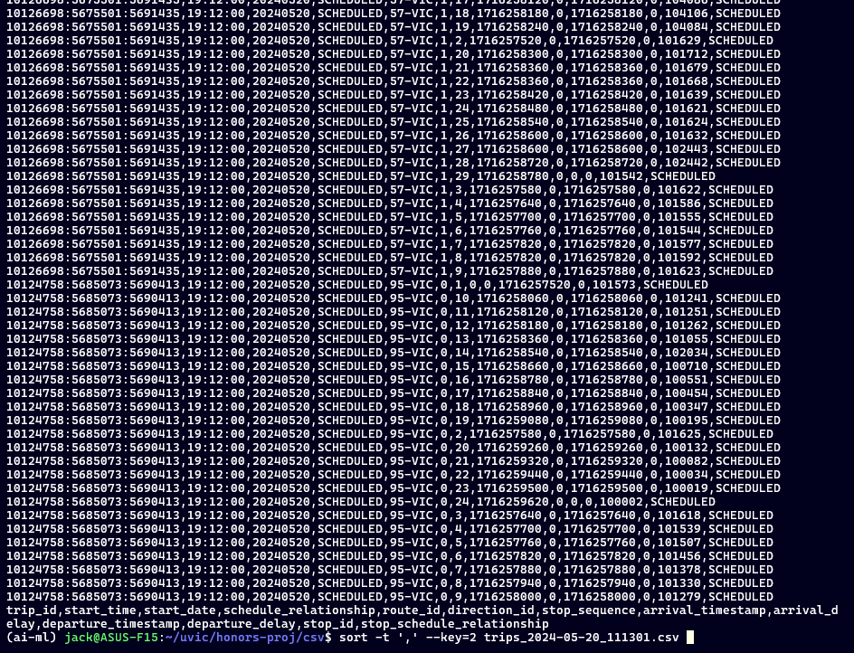
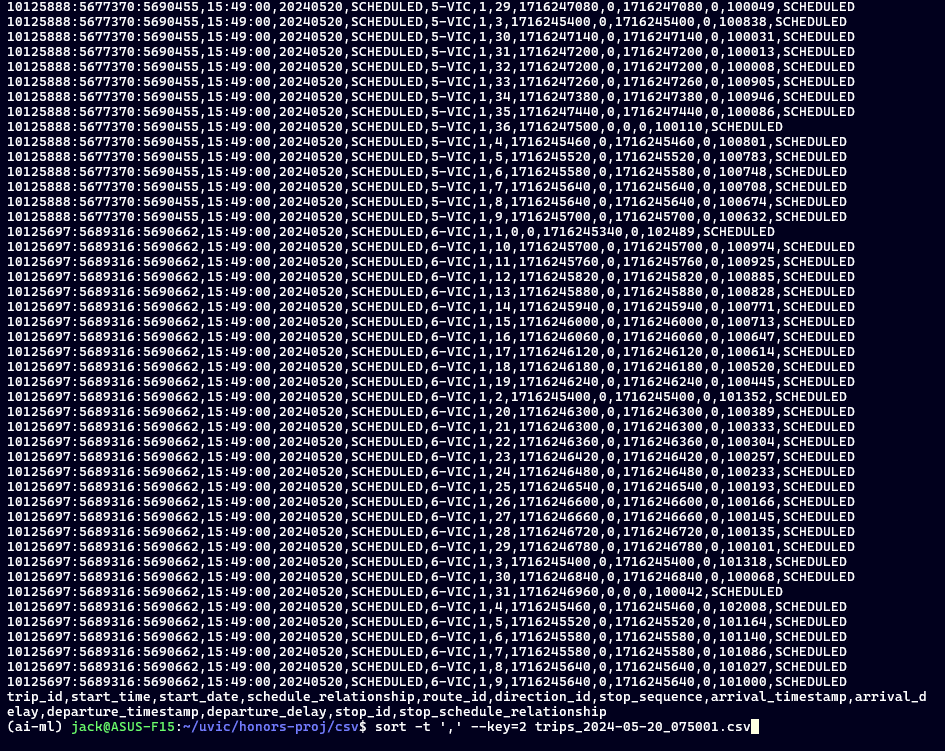
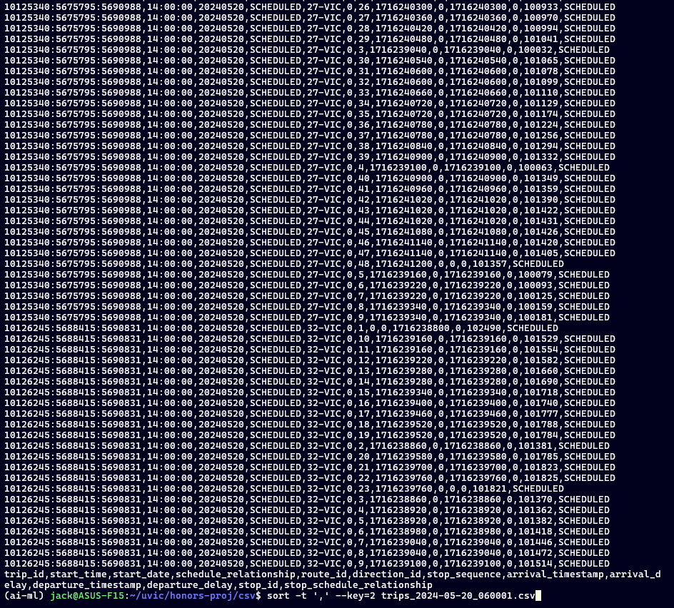
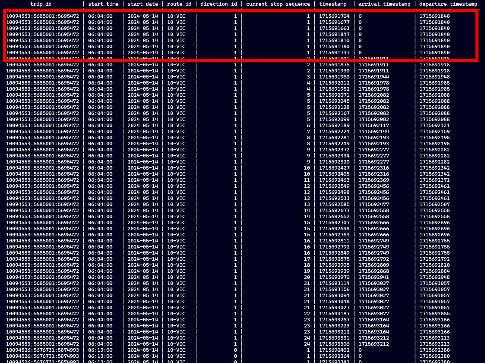
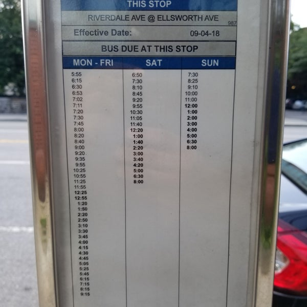
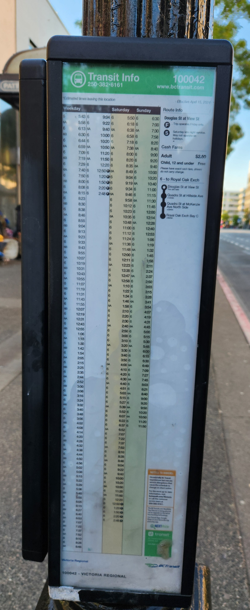
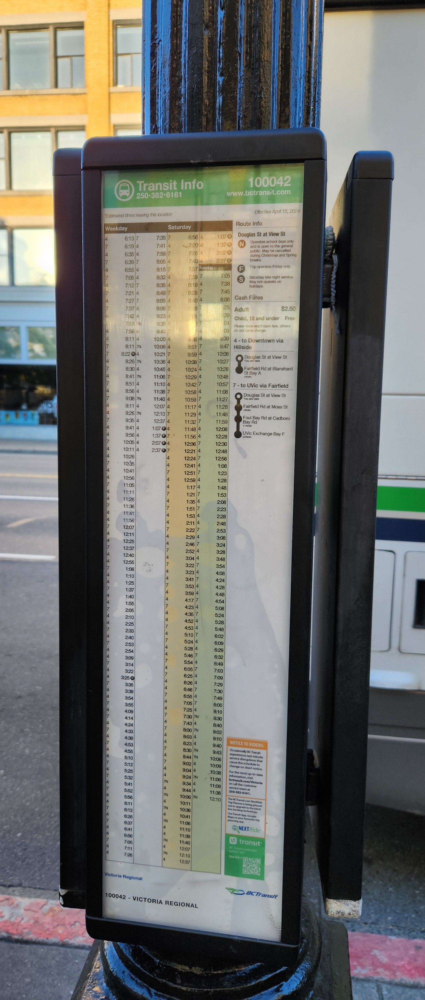
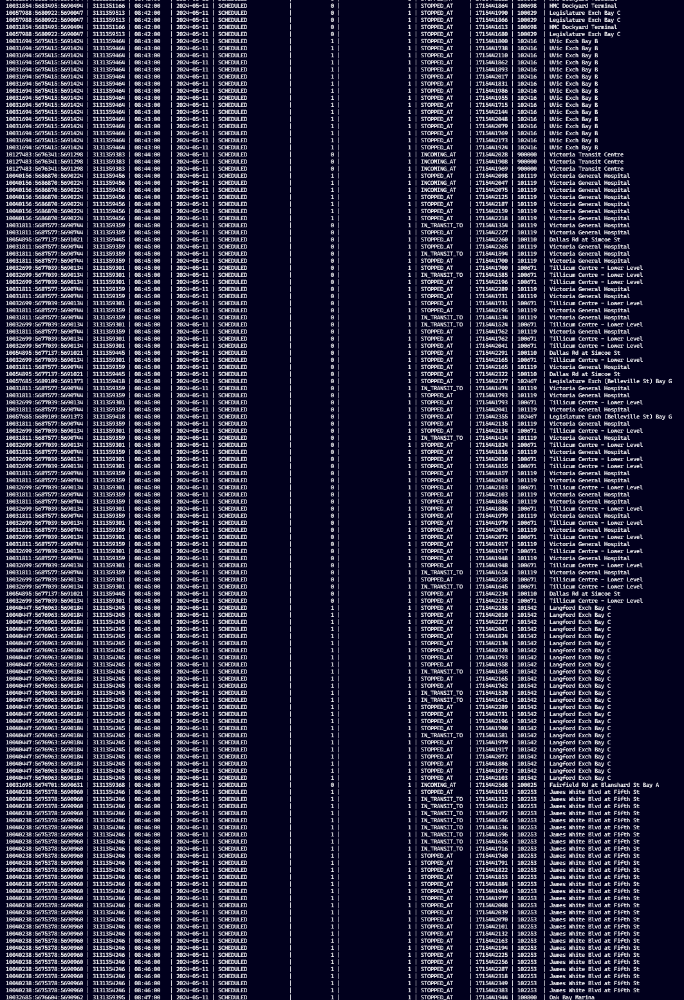

# June 9

## Notes
- Seems that stop times have no difference in between them
    - Which doesn't quite line up with what we thought, which is weird...
    - There's no abstraction, so how are the trips organized? Is it just
    the same for every day? Then where does the abstraction comes from?
- Almost at the time where we can start joining and writing the results to
files. Only thing remaining is to figure out what to do when the bus is not
currently stopped at the stop but in transit. Do we try to estimate based on
long/lat coordinates... This requires further research.

## Findings
- Mon-Fri trips share similar trip_ids but are different from the Saturday
trips and Sunday trips. This is not revealed in the stop_times static data,
but can be seen from the tripupdates!
- A trip_id uniquely determines a route, a direction, and a start time
- Daniel was right, it seems that tripupdates data are windowed between
8-hour intervals. Every trip that *starts* <= 8 hours after the fetch time
is included

- Early morning tripupdates may contain information from the previous day
- There's no 00 for hours in the data, it is 24 instead. This is annoying
because it means the previous day contains information about the trips
in the first hour of the next day
    - However, this might not be an issue if we only consider busses that
    operate between say 6 AM - 9 PM
    - Note that, contrary to previous belief, they actually go up until
    27 hours, which is the end of the day at 3 AM

# June 3

## Notes
- Maybe use `csvtool` from Linux to see the difference between the
tripupdate files
    - Do set union and difference to figure out what's different between
- Make two diagrams, one of the original data and one of the dumped data
- Since we already have pictures of the bus stops, check if the two
data are consistent

# June 2

## Notes
- `arrival_timestamp` is 0 for the first stop of the trip and
`departure_timestamp` is 0 for the last stop of the trip. Is that good
or do we want some value (for example, copy one from the other if the
value is 0)
- It seems Daniel was right! `trip_id` does determine the route and
start time of a trip for the abstract timetables. It seems that they match
but only what looks to be the abstract timetables
    - Mon-Fri trips have the same `trip_id` that uniquely identifies a trip
    - Does Sat and Sun trips also have the same `trip_id` or is it different?
- We might be fetching data too quickly resulting in multiple entries of
a vehicle that is heading to or waiting at a specfic stop but with different
timestamps. Need to include longitude and latitude information to make sure
that the vehilcles are not in the same position. If they are in the same
position, **find a way to retain only the latest of those or condense** 
**the data in a way that allows us to have only 1 stop entry per stop**

# May 27

## Notes
- Static data seems to change, what changes. Document that and document
the data
- Maybe consider moving to SQLite from Postgres
- Get the abstract time tables by checking the flyers near
bus stops
    - Since the assumption is that timetables are created for weekdays
    and separate ones for weekends, these are the abstract timetables
    Examples: 
     
- The expected timetables are what's seen in the stop_data
- The actual timetables are the ones in the data
- Since we have longitude and latitude information, encode that
into the data and be able to exactly where the bus is!
    - We also have longitude and latitude inforamtion in the stops, can we
    maybe query google on the distance between the two stops and estimate
    to a much higher precision where the bus is?
- Does a trip ID uniquely identify a trip? Can we get an intuition of
how the trip ID is formed?
    - Document and read

- Move notes into TODO

# May 26

## Notes
- Stop sequences do not necessarily refer to the same stop at all times

- `metadata/trips.txt` is somewhat redundant
- `metadata/stop_times.txt` is the file we want, but it seems to get
updated daily with new `trip_id`'s. Meaning, unless we do that daily, we
cannot recover arrival/departure times without looking at `tripupdates`
    - Need to somehow extract this information from tripupdates, maybe
    from an early file so that arrival and departure times aren't altered

## Brainstorming
In order to recreate the timetables from tripupdates, I should read the files
one by one starting from the earliest and keep incrementally adding while
discarding duplicates. This in theory should work, depending on how the files
differ... If my hypothesis is correct, this will work

There should never be two busses on the same route following the exact same
schedule, so it should be reasonable to have the primary key be the date,
time, route, and direction

# May 20

## Decisions
- Write one paragraph as the project description
- Pose questions from the prespective of the user

# May 19

## Notes
- ~~It seems like the trip_id somehow encodes the vehicle_id as well. By
browsing through the data, trip_id uniquely identifies the
`(vehicle_id, start_time, route_id, direction_id)`. Therefore,
`(trip_id, timestamp)` can be used as a composite primary key~~. The trip_id
does **not** encode the `vehicle_id` information, so it needs to be included
as part of the composite primary key as `(trip_id, vehicle_id, timestamp)`

# May 13

## Notes
- Files in tripupdates only have delays for the busses that are operating
around 30 minutes from fetching time, so the script has been split in two:
    - Fetch vehicleupdates every 30 seconds
    - Fetch tripupdates every 20 minutes

## Decisions
- Split scraping file into two and adjust timings
- No need to cut down tripupdates any more, revert scripts to
how they were before

# May 12

## Notes
- A repo has been created to be shared between student and supervisor to ease
file and knowledge transfers
- The files fetched as tripupdates are quite large, do we need all the data?

## Decisions
- Meeting are going to take place every Monday at 9:00 PM

# May 9

## Notes
- Think in terms of questions that are important for the domain
	- Solve problems, do not create more
- [x] Make one script that downloads vehicle information every 30 seconds
- [ ] Do timeseries, they retain the information about the time of
day and day that is happening
Feed that into a machine learning model
- [x] Write a couple paragraphs about what we're doing and a couple
questions that we hope to answer **BY MONDAY**
	- Questions:
		- Are there delay patterns that can be learned using a machine learning
        model based on the day of the week, time, and route?
- [x] Write a Bash script that runs the Python script and zips the output files
