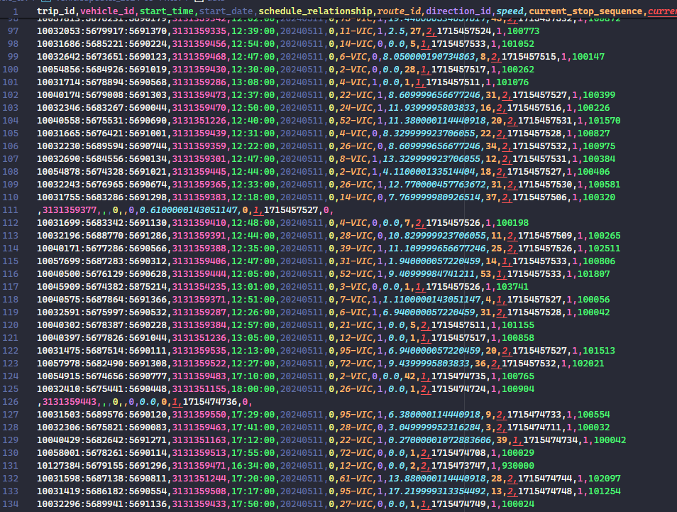
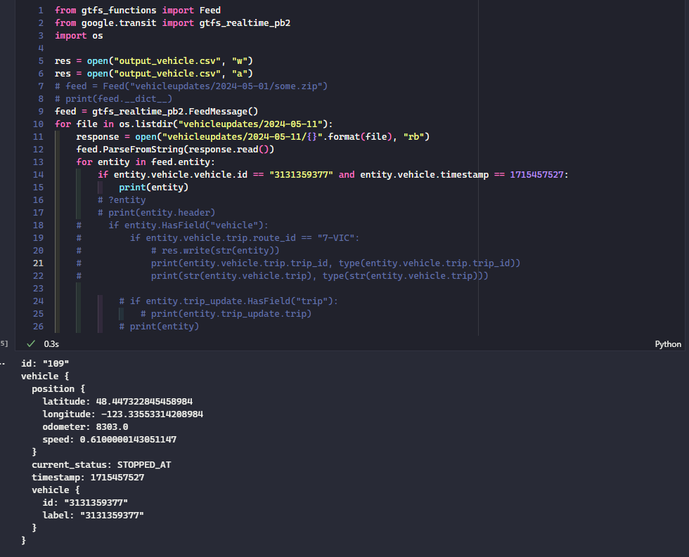

## Researching

- [ ] Find out how to generate tripupdate information using vehicleupdates
and the static data. Probably some cross-correlation with the static data
- [ ] Learn about timeserires
- [ ] Check whether the data reflects the fact that some busses become
other busses (7 to 21 and vice versa). Check if the vehicle ID remains and
whether you can trace that relation from the data
- [ ] Find out what happens to the order of the stops if there is construction,
does the bus seem like it skipped a number of stops from the data or is there
a correlation between the old and new stops?
- [ ] Should the status codes be saved in their own table rather than being
just out there in the data?
- [ ] Research if there is a better way of representing timestamps in the
SQL tables other than `VARCHAR`
- [ ] Since we already have pictures of the bus stops, check if the two
data are consistent
- [ ] Update the UML diagram to also contain the paths of where the
fields reside and where the information (which file) the information is
obtained from
- [ ] Find some kind of heuristic to find when the bus was at a stop
    - Maybe just estimate the bus to have been in the middle
- [ ] Document the from the dumped data to the data that we need!
    - Once we have the data we need, we don't need the original data anymore
    - KEEP THE MODELS INDEPENDENT, we have TWO models
    - Do transcoding first, verify it's good, then move forward with doing
    other manipulation
- [ ] Trips should be converted to be the delta between two subsequent
stops
- [ ] Some tripupdates data have trips that have no stop time updates, why
is this the case? Investigate
- [ ] Think about how to construct a metric to measure the goodness of a
route. Just consider the last estimation of a trip because that's the closest
to reality
    - Is it better to plan the day before for a trip or two hours in advance?
    How much variablility is there?
    - Also maybe do one for the real data. Daniel thinks that there might not
    be much variability between the real data and the last expected trip but
    might be interesting to compare the two
    - Compute a vector with different metrics of statistics from the data
    and plot them to see which of the statistical values have the best
    estimation and give us the best value. For example:
        - Just the difference between the abs(a start time - e start time) + abs(a end time - e end time)
        - The sum of the deltas of the difference between the stops
        - Maybe consider the median delay value
        - The mean of the delays across all stops for a trip
    - The more late the bus is, the more annoying it is. But maybe it's more
    of a exponential grows between how late vs how annoyed people are
    - Think like a user of the bus system, what are the things you'd be concerned about?
        - How late/early?
        - Is the bus sticking to the timetable or is it running behind on some stops?
    - Maybe there are a number of metrics that none of them are good
- [ ] Look into how the delays are calculated? Can we get a rough estimate by
looking at all the expected trips for a trip and see how the delay numbers
are changing?
- [ ] Divide the expected timetable file further into theoretical (name under
consideration) and in progress trips. In progress trips are ones whose first
stop time update stop sequence is not 1. This will allow us to view the
updates made to the trips and maybe observe the pattern in a clean environment

## In Progress
- [ ] Is there any alternatives to using `(trip_id, vehicle_id, timestamp)`
as a composite primary key?
    - `stop_id` won't work if the bus spent more than 30 seconds heading or
    stopping at a single stop, which might happen at the start of the route

## Done

- [x] Find out what can be cut away from tripupdates
- [x] Write a script/program that generates a .csv file from vehicleupdates
- [x] Revert scripts to how they were before
- [x] Verify what `IN_TRANSIT_TO` and `STOPPED_AT` mean
    - > Added a proto_enums.py file that contains information taken
    from the github page that describes what fields mean
- [x] Investigate weird rows in vehicleupdates that contain hardly any
information 
    - It seems like some vehicle stop somewhere and do not get assigned routes
    (maybe stopped for service, break, etc.). These vehicles will be ignored
    
- [x] Adjust questions in the `project_description.md` to be from the
prespective of the user
- [x] Create tables for stops and try to join with vehicle_data
- [x] Modify vehicleupdates parser script to also dump the longitude and
latitude information so we can accurately determine the position of a bus
- [x] Create a UML diagram of the data
- [x] Make a file similar to vehicleupdates_to_csv but for tripupdates
    - [x] Make a text version 
    - [x] Understand why the sizes are different as files seem to become larger
    and larger until ~10 AM, then they plateau for a bit, then they decrease
    in size
        > The decrease is understandable because tripupdates only contains
        information from that point in the day until the end of the day, or
        that's how it was assumed so far at least. However, the increase is
        weird
        >> Perhaps the compression is causing this?
        - [x] **ANSWER** Turns out that Daniel was right and tripupdates
        were windowed. From light inspection, it seems like every file contains
        information about trips that start <= 8 hours after the fetch time.
        Meaning, to fully capture one day, at least 3 files are needed. For
        some more accuracy, maybe 6 files can be used (every 4 hours) to build
        the schedule for a day
    - [x] After completing the first task, create a script that converts the
    `pb` files into `csv` files - might only need a handful of tripupdates
    files for an entire day to create a table for that day
        - [x] Some entries has arrival and departure times omitted from
        the data for some reason. Wrote comments on how to remedy that
- [x] Extract the expected and abstract timetables at once by using all
the tripupdates files for a specific day. If the trip has delays, then add
it to the expected timetables. If the trip has no delays, add it to the
abstract one. There will be a lot of overlap, especially in the abstract
timetables, and there will be many version of a trip in the expected
timetables. What's interesting will be to see how well BC transit predicts
delays as time gets closer to the actual trip time
- [x] Document the dumping of the data and how it links to the original
