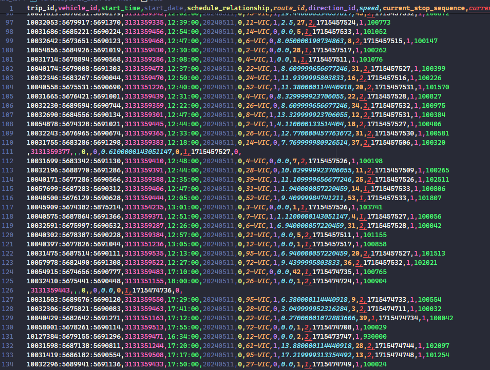

# Incomplete
- [ ] Investigate weird rows in vehicleupdates that contain hardly any
information 
- [ ] Document the data
- [ ] Verify what `IN_TRANSIT_TO` and `STOPPED_AT` mean
- [ ] Find out how to generate tripupdate information using vehicleupdates
and the static data. Probably some cross-correlation with the static data
- [ ] Learn about timeserires
- [ ] Check whether the data reflects the fact that some busses become
other busses (7 to 21 and vice versa). Check if the vehicle ID remains and
whether you can trace that relation from the data
- [ ] Find out what happens to the order of the stops if there is construction,
does the bus seem like it skipped a number of stops from the data or is there
a correlation between the old and new stops?

# Done
- [x] Find out what can be cut away from tripupdates
- [x] Write a script/program that generates a .csv file from vehicleupdates
- [x] Revert scripts to how they were before